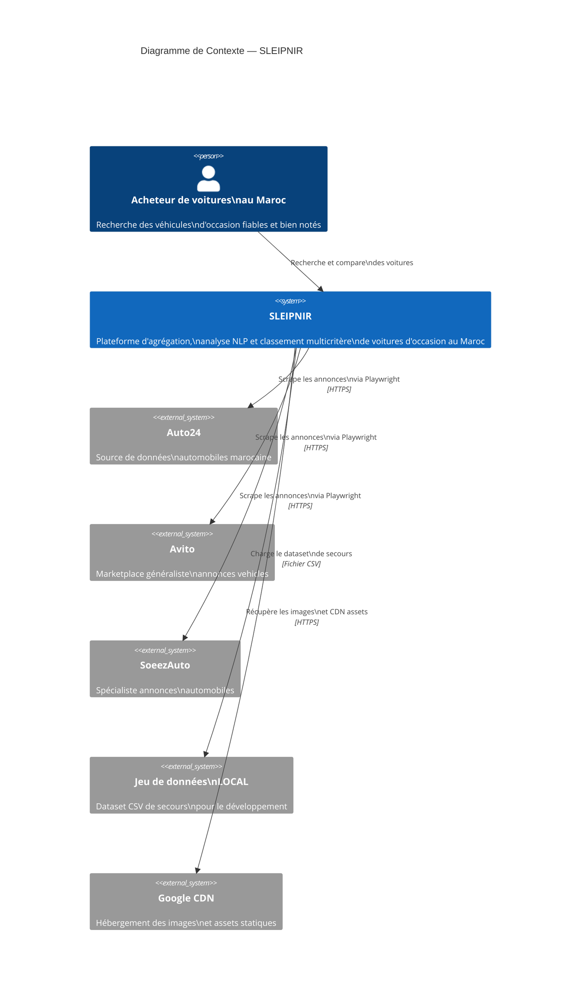
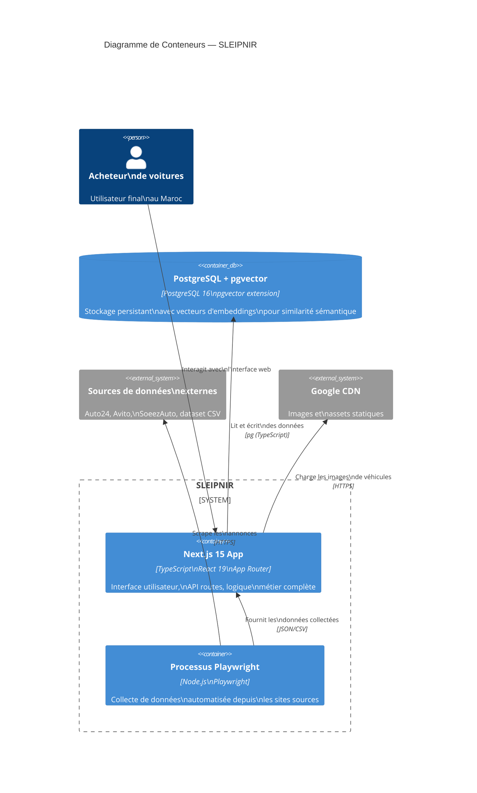
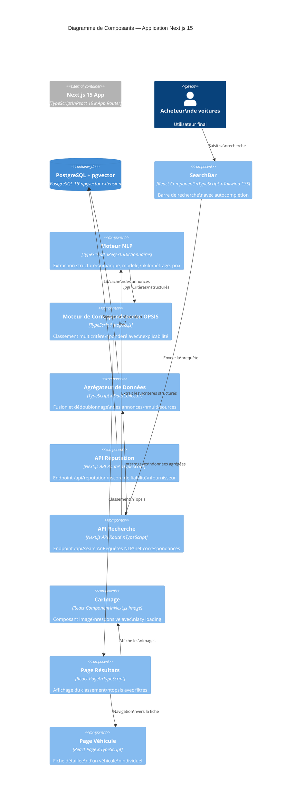

# Architecture C4 — SLEIPNIR

## Niveau 1 — Diagramme de Contexte

```mermaid
C4Context
    title Diagramme de Contexte — SLEIPNIR

    Person(acheteur, "Acheteur de voitures\nau Maroc", "Recherche des véhicules\nd'occasion fiables et bien notés")

    System(sleipnir, "SLEIPNIR", "Plateforme d'agrégation,\nanalyse NLP et classement multicritère\nde voitures d'occasion au Maroc")

    System_Ext(auto24, "Auto24", "Source de données\nautomobiles marocaine")
    System_Ext(avito, "Avito", "Marketplace généraliste\nannonces vehicles")
    System_Ext(soeezauto, "SoeezAuto", "Spécialiste annonces\nautomobiles")
    System_Ext(fallback, "Jeu de données\nLOCAL", "Dataset CSV de secours\npour le développement")
    System_Ext(googlecdn, "Google CDN", "Hébergement des images\net assets statiques")

    Rel(acheteur, sleipnir, "Recherche et compare\ndes voitures")
    Rel(sleipnir, auto24, "Scrape les annonces\nvia Playwright", "HTTPS")
    Rel(sleipnir, avito, "Scrape les annonces\nvia Playwright", "HTTPS")
    Rel(sleipnir, soeezauto, "Scrape les annonces\nvia Playwright", "HTTPS")
    Rel(sleipnir, fallback, "Charge le dataset\nde secours", "Fichier CSV")
    Rel(sleipnir, googlecdn, "Récupère les images\net CDN assets", "HTTPS")
```

## Niveau 2 — Diagramme de Conteneurs

```mermaid
C4Container
    title Diagramme de Conteneurs — SLEIPNIR

    Person(acheteur, "Acheteur\nde voitures", "Utilisateur final\nau Maroc")

    System_Boundary(sleipnir, "SLEIPNIR") {
        Container(nextjs, "Next.js 15 App", "TypeScript\nReact 19\nApp Router", "Interface utilisateur,\nAPI routes, logique\nmétier complète")
        Container(playwright, "Processus Playwright", "Node.js\nPlaywright", "Collecte de données\nautomatisée depuis\nles sites sources")
    }

    ContainerDb(postgres, "PostgreSQL + pgvector", "PostgreSQL 16\npgvector extension", "Stockage persistant\navec vecteurs d'embeddings\npour similarité sémantique")

    System_Ext(sources, "Sources de données\nexternes", "Auto24, Avito,\nSoeezAuto, dataset CSV")
    System_Ext(cdn, "Google CDN", "Images et\nassets statiques")

    Rel(acheteur, nextjs, "Interagit avec\nl'interface web")
    Rel(nextjs, postgres, "Lit et écrit\ndes données", "pg (TypeScript)")
    Rel(nextjs, cdn, "Charge les images\nde véhicules", "HTTPS")
    Rel(playwright, sources, "Scrape les\nannonces", "HTTPS")
    Rel(playwright, nextjs, "Fournit les\ndonnées collectées", "JSON/CSV")
```

## Niveau 3 — Diagramme de Composants (Next.js App)

```mermaid
C4Component
    title Diagramme de Composants — Application Next.js 15

    Container_Ext(nextjs, "Next.js 15 App", "TypeScript\nReact 19\nApp Router")

    Person(acheteur, "Acheteur\nde voitures", "Utilisateur final")

    ContainerDb(postgres, "PostgreSQL + pgvector", "PostgreSQL 16\npgvector extension")

    Component(searchbar, "SearchBar", "React Component\nTypeScript\nTailwind CSS", "Barre de recherche\navec autocomplétion")
    Component(nlpengine, "Moteur NLP", "TypeScript\nRegex\nDictionnaires", "Extraction structurée\nmarque, modèle,\nkilométrage, prix")
    Component(matching, "Moteur de Correspondance\nTOPSIS", "TypeScript\ntopsis.js", "Classement multicritère\npondéré avec\nexplicabilité")
    Component(aggregator, "Agrégateur de Données", "TypeScript\nDataCollector", "Fusion et dédoublonnage\ndes annonces\nmulti-sources")
    Component(reputation, "API Réputation", "Next.js API Route\nTypeScript", "Endpoint /api/reputation\nscore de fiabilité\nfournisseur")
    Component(searchapi, "API Recherche", "Next.js API Route\nTypeScript", "Endpoint /api/search\nRequêtes NLP\net correspondances")
    Component(carimage, "CarImage", "React Component\nNext.js Image", "Composant image\nresponsive avec\nlazy loading")
    Component(results, "Page Résultats", "React Page\nTypeScript", "Affichage du classement\ntopsis avec filtres")
    Component(vehicle, "Page Véhicule", "React Page\nTypeScript", "Fiche détaillée\nd'un véhicule\nindividuel")

    Rel(acheteur, searchbar, "Saisit sa\nrecherche")
    Rel(searchbar, searchapi, "Envoie la\nrequête")
    Rel(searchapi, nlpengine, "Extrait les\ncritères structurés")
    Rel(nlpengine, matching, "Critères\nstructurés")
    Rel(matching, results, "Classement\nTopsis")
    Rel(results, carimage, "Affiche les\nimages")
    Rel(results, vehicle, "Navigation\nvers la fiche")
    Rel(searchapi, aggregator, "Interroge les\ndonnées agrégées")
    Rel(aggregator, postgres, "Lit/cache\ndes annonces", "pg")
    Rel(reputation, postgres, "Score de\nréputation", "pg")
```
