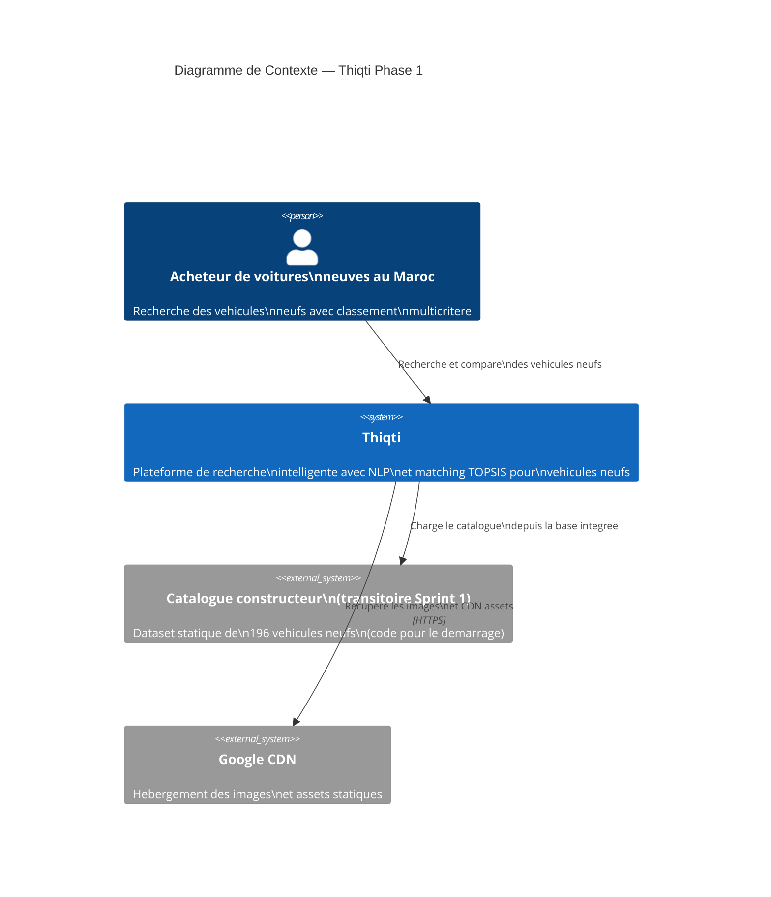
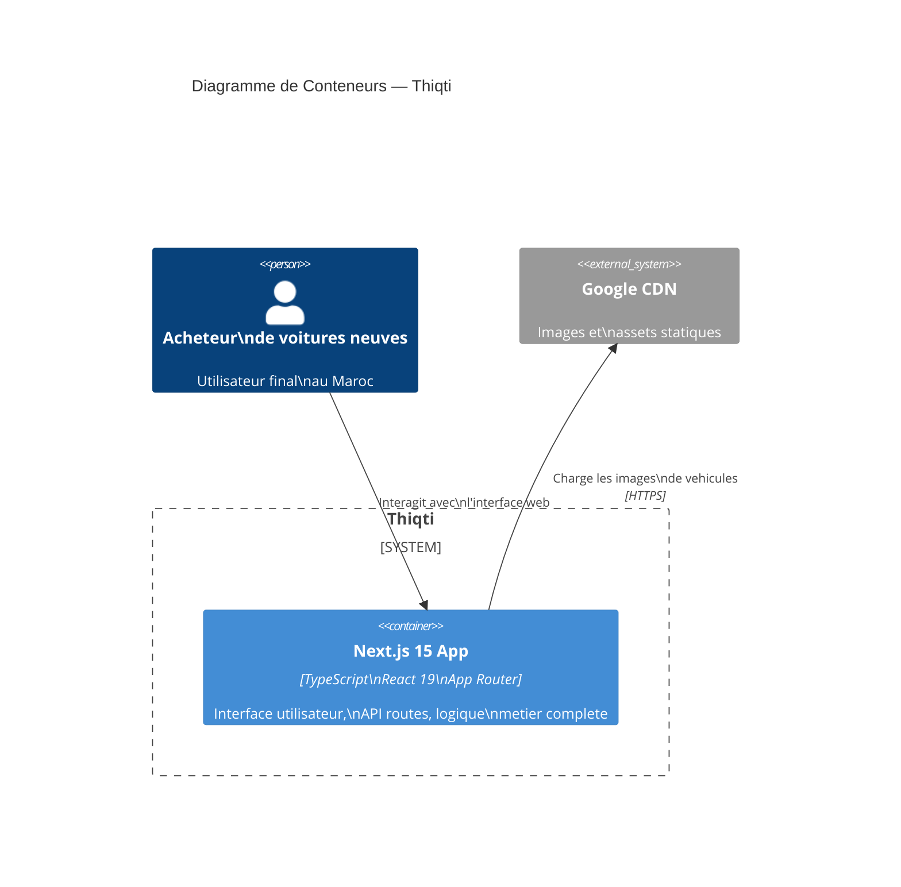
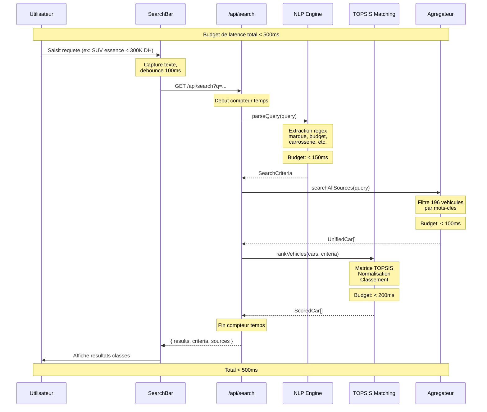

# Architecture C4 — Thiqti (Phase 1)

## Niveau 1 — Diagramme de Contexte



## Niveau 2 — Diagramme de Conteneurs



## Niveau 3 — Diagramme de Composants (Next.js App)

```mermaid
C4Component
    title Diagramme de Composants — Application Next.js 15

    Container_Ext(nextjs, "Next.js 15 App", "TypeScript\nReact 19\nApp Router")

    Person(acheteur, "Acheteur\nde voitures neuves", "Utilisateur final")

    Component(searchbar, "SearchBar", "React Component\nTypeScript\nTailwind CSS", "Barre de recherche\navec autocompletion\net suggestions")
    Component(nlpengine, "Moteur NLP", "TypeScript\nRegex\nDictionnaires", "Extraction structuree\nmarque, modele,\nbudget, carrosserie")
    Component(matching, "Moteur de\nCorrespondance TOPSIS", "TypeScript\nAlgorithme\nproprietaire", "Classement multicritere\npondere avec\nexplicabilite")
    Component(aggregator, "Agregateur de\nDonnees (Fallback)", "TypeScript", "Cache du catalogue\nconstructeur, 196\nvehicules neufs")
    Component(reputation, "API Reputation", "Next.js API Route\nTypeScript", "Endpoint /api/reputation\nscore de fiabilite\npar modele")
    Component(searchapi, "API Recherche", "Next.js API Route\nTypeScript", "Endpoint /api/search\nRequete NLP\net matching")
    Component(compare, "Page Comparaison", "React Page\nTypeScript", "Comparaison de 2-3\nvehicules avec\nscores detailles")
    Component(carimage, "CarImage", "React Component\nNext.js Image", "Composant image\nresponsive avec\nlazy loading")
    Component(results, "Page Resultats", "React Page\nTypeScript", "Affichage du classement\ntopsis avec filtres\net barometre")
    Component(vehicle, "Page Vehicule", "React Page\nTypeScript", "Fiche detaillee\nd'un vehicule neuf\nindividuel")
    Component(auth, "Auth API", "Next.js API Route\nTypeScript\nbcrypt + JWT", "Login/logout admin\navec mots de passe\nhashes")

    Rel(acheteur, searchbar, "Saisit sa\nrecherche")
    Rel(searchbar, searchapi, "Envoie la\nrequete")
    Rel(searchapi, nlpengine, "Extrait les\ncriteres structures")
    Rel(nlpengine, matching, "Criteres\nstructures")
    Rel(matching, results, "Classement\nTopsis")
    Rel(results, carimage, "Affiche les\nimages")
    Rel(results, vehicle, "Navigation\nvers la fiche")
    Rel(results, compare, "Ajout a la\ncomparaison")
    Rel(searchapi, aggregator, "Interroge les\ndonnees en cache")
    Rel(aggregator, fallback, "Lit le catalogue\nconstructeur")
    Rel(reputation, results, "Scores de\nreputation")
```

## Vue de Sequence — Chemin Critique



## Budget de Latence

| Etape | Budget | Outil |
|-------|--------|-------|
| Debounce saisie | 100ms | cote client |
| NLP parseQuery | < 150ms | regex in-memory |
| searchAllSources | < 100ms | cache + filtre |
| rankVehicles (TOPSIS) | < 200ms | matrice in-memory |
| Reponse reseau | < 50ms | Next.js local |
| **Total** | **< 500ms** | **Sprint 1** |
