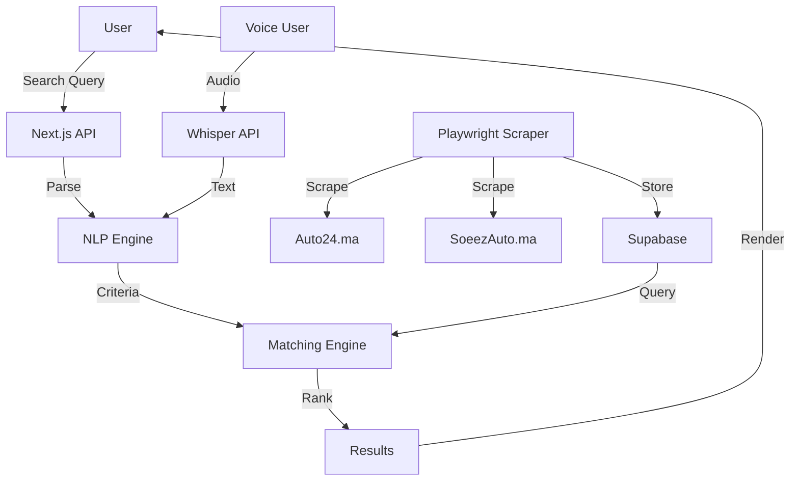

# SLEIPNIR — Data Processing Register

**Ref**: VV-SLP-2026-001  
**Date**: 2026-07-17  
**Status**: Active  
**Legal Basis**: Loi 09-08 relative à la protection des personnes physiques à l'égard du traitement des données à caractère personnel

---

## 1. Data Controller

| Field | Value |
|-------|-------|
| **Controller** | SLEIPNIR Project Team |
| **DPO Contact** | `dpo@thiqti.com` (Phase 2) |
| **Address** | École Nationale Supérieure d'Informatique (ENSIAS), Rabat, Morocco |
| **Role** | Joint controllers (team members) |

---

## 2. Treatments Register

### Treatment 001: Vehicle Search

| Field | Value |
|-------|-------|
| **Treatment ID** | `SLEIPNIR-001-SEARCH` |
| **Purpose** | Provide vehicle search results based on natural language queries |
| **Legal Basis** | Consent (user initiates search) |
| **Data Categories** | Search query (text), navigation data (implicit) |
| **Data Subjects** | Website visitors |
| **Retention** | Search queries: 24 hours (log rotation) |
| **Access** | Server-side only (Node.js) |
| **Transfer** | None (processed in Morocco) |
| **Security** | HTTPS, no storage of personal data |

### Treatment 002: Vehicle Data Collection

| Field | Value |
|-------|-------|
| **Treatment ID** | `SLEIPNIR-002-COLLECTION` |
| **Purpose** | Collect and aggregate vehicle data from public sources |
| **Legal Basis** | Legitimate interest (public data aggregation) |
| **Data Categories** | Vehicle specs (make, model, year, price, mileage, fuel, body type) |
| **Data Subjects** | None (vehicles, not persons) |
| **Retention** | Vehicle data: refreshed every 24 hours |
| **Access** | Server-side scraper (Playwright) |
| **Transfer** | Data collected from Moroccan websites only |
| **Security** | Automated collection, no human intervention |

### Treatment 003: User Favorites (Phase 2)

| Field | Value |
|-------|-------|
| **Treatment ID** | `SLEIPNIR-003-FAVORITES` |
| **Purpose** | Store user's favorite vehicles for future reference |
| **Legal Basis** | Consent (user explicitly saves) |
| **Data Categories** | Vehicle IDs, user session ID |
| **Data Subjects** | Registered users |
| **Retention** | Until user deletes or account inactive 12 months |
| **Access** | User (own data), Supabase with RLS |
| **Transfer** | None |
| **Security** | Supabase RLS, encrypted at rest |

### Treatment 004: Reputation Data (Phase 2)

| Field | Value |
|-------|-------|
| **Treatment ID** | `SLEIPNIR-004-REPUTATION` |
| **Purpose** | Provide brand/model reputation scores |
| **Legal Basis** | Legitimate interest (public review aggregation) |
| **Data Categories** | Aggregated review scores, sentiment analysis |
| **Data Subjects** | None (vehicles, not persons) |
| **Retention** | 12 months (refreshed monthly) |
| **Access** | Server-side only |
| **Transfer** | None |
| **Security** | Aggregated data only, no individual reviews stored |

### Treatment 005: Voice Input (Phase 3)

| Field | Value |
|-------|-------|
| **Treatment ID** | `SLEIPNIR-005-VOICE` |
| **Purpose** | Convert voice queries to text for search |
| **Legal Basis** | Consent (user activates microphone) |
| **Data Categories** | Audio recording (transient, not stored) |
| **Data Subjects** | Users who use voice feature |
| **Retention** | Audio: processed in real-time, not stored; text: same as Treatment 001 |
| **Access** | Whisper API (external processor) |
| **Transfer** | Audio sent to OpenAI API (US) |
| **Security** | HTTPS, transient processing only |

---

## 3. Data Categories Detailed

### 3.1 Vehicle Data (Non-Personal)

| Category | Examples | Source | Refresh |
|----------|----------|--------|---------|
| Vehicle specs | Make, model, year, engine | Auto24.ma, SoeezAuto.ma | 24 hours |
| Pricing | New price, used price, Argus | SoeezAuto.ma | 24 hours |
| Images | Vehicle photos | Google CDN | On-demand |
| Availability | In stock, sold, reserved | Auto24.ma | 24 hours |
| Technical | Mileage, fuel type, transmission | Auto24.ma | 24 hours |

### 3.2 User Data (Personal — Phase 2+)

| Category | Examples | Storage | Retention |
|----------|----------|---------|-----------|
| Session data | Anonymous session ID | LocalStorage | Until cleared |
| Favorites | Saved vehicle IDs | LocalStorage / Supabase | 12 months |
| Search history | Recent queries (optional) | LocalStorage | 24 hours |
| Voice audio | Transient audio | Not stored | Real-time only |

### 3.3 Aggregated Data

| Category | Examples | Privacy Impact |
|----------|----------|----------------|
| Search statistics | Total searches, avg response time | No personal data |
| Top queries | Most common search terms | No personal data |
| Source metrics | Vehicles per source | No personal data |

---

## 4. Data Flows

---

## 5. Rights of Data Subjects

| Right | Loi 09-08 Article | Implementation | Phase |
|-------|-------------------|----------------|-------|
| **Right of access** | Art. 28 | `GET /api/user/data` | Phase 2 |
| **Right of rectification** | Art. 29 | `PUT /api/user/data` | Phase 2 |
| **Right of deletion** | Art. 30 | `DELETE /api/user/data` | Phase 2 |
| **Right of opposition** | Art. 31 | Opt-out mechanism | Phase 2 |
| **Right of portability** | Art. 28 | JSON export | Phase 2 |
| **Right to limit processing** | Art. 30 | Account deactivation | Phase 3 |

### How to Exercise Rights

| Method | Contact | Response Time |
|--------|---------|---------------|
| Email | `dpo@thiqti.com` | 30 days |
| In-app | Settings → Privacy | Immediate for deletion |
| API | `/api/user/privacy` | 48 hours |

---

## 6. Data Security Measures

### 6.1 Technical Measures

| Measure | Implementation |
|---------|----------------|
| Encryption in transit | HTTPS (TLS 1.3) via Vercel |
| Encryption at rest | Supabase (AES-256) |
| Access control | Supabase RLS (Phase 2) |
| Input validation | Max 200 chars, char whitelist |
| SQL injection prevention | Parameterized queries |
| XSS prevention | React auto-escaping + CSP |
| Backup | Supabase daily backups (Phase 2) |

### 6.2 Organizational Measures

| Measure | Implementation |
|---------|----------------|
| Data minimization | Only collect necessary data |
| Purpose limitation | Data used only for stated purpose |
| Staff training | Team aware of data protection obligations |
| Incident response | 72-hour notification to CNDP (Art. 43) |

---

## 7. International Data Transfers

| Transfer | Destination | Safeguard | Legal Basis |
|----------|-------------|-----------|-------------|
| Whisper API (Phase 3) | OpenAI (US) | Standard Contractual Clauses | Consent |
| Vercel hosting | Vercel Inc. (US) | Data Processing Agreement | Consent |
| Supabase (Phase 2) | Supabase Inc. (US) | Standard Contractual Clauses | Consent |

---

## 8. Data Protection Impact Assessment (DPIA)

### When Required

DPIA is required under Art. 42 when processing:
- Systematic monitoring of data subjects
- Processing of sensitive data on a large scale
- Automated decision-making with legal effects

### SLEIPNIR Assessment

| Criteria | Present? | Justification |
|----------|----------|---------------|
| Systematic monitoring | No | No user tracking |
| Sensitive data | No | No health, biometric, or political data |
| Automated decisions | No | Search results are suggestions, not decisions |
| Large scale | No | MVP with <1000 users |

**DPIA Required**: No (MVP does not meet threshold)

---

## 9. Data Breach Response Plan

| Step | Action | Timeline |
|------|--------|----------|
| 1. Detection | Monitor logs, error tracking | Immediate |
| 2. Assessment | Determine severity and affected data | 24 hours |
| 3. Containment | Block attack vector, revoke access | 24 hours |
| 4. Notification (CNDP) | Report to Commission Nationale de Contrôle | 72 hours |
| 5. Notification (Users) | Inform affected users if high risk | 72 hours |
| 6. Remediation | Fix vulnerability, update security measures | 1 week |
| 7. Post-mortem | Document incident, update procedures | 2 weeks |

---

## 10. Cookie & Tracking Policy

### MVP (Phase 1)

| Cookie Type | Used? | Purpose |
|-------------|-------|---------|
| Essential | No | No session cookies |
| Analytics | No | No tracking |
| Marketing | No | No ads |
| Preferences | No | LocalStorage only |

### Phase 2

| Cookie Type | Used? | Purpose |
|-------------|-------|---------|
| Essential | Yes | Session management |
| Analytics | Optional | Vercel Analytics (opt-in) |
| Marketing | No | N/A |

---

## 11. CNDP Notification

### Registration Required?

| Criteria | Present? |
|----------|----------|
| Processing personal data | Phase 2 only (favorites) |
| More than 50 data subjects | Unlikely in MVP |
| Automated decisions | No |
| Sensitive data | No |

**Notification Required**: Not yet (Phase 1 has no PII). Will register when Phase 2 launches.

### Notification Form (Phase 2)

| Field | Value |
|-------|-------|
| Controller | SLEIPNIR Team |
| Treatment | User favorites and search history |
| Purpose | Vehicle search platform |
| Data categories | Session ID, favorites, search queries |
| Recipients | Supabase (processor) |
| Transfer | US (Supabase Inc.) |
| Retention | 12 months |

---

## 12. Compliance Checklist

| Requirement | Status | Notes |
|-------------|--------|-------|
| Lawful basis for processing | ✅ | Consent (searches), Legitimate interest (public data) |
| Purpose limitation | ✅ | Vehicle search only |
| Data minimization | ✅ | No unnecessary data collected |
| Accuracy | ✅ | Vehicle data refreshed every 24h |
| Storage limitation | ✅ | Logs rotate after 24h |
| Integrity & confidentiality | ✅ | HTTPS, CSP, input validation |
| Rights of subjects | ⏳ | Phase 2 API endpoints |
| DPO appointment | ⏳ | Phase 2 |
| DPIA | N/A | Not required for MVP |
| CNDP notification | ⏳ | Phase 2 |
