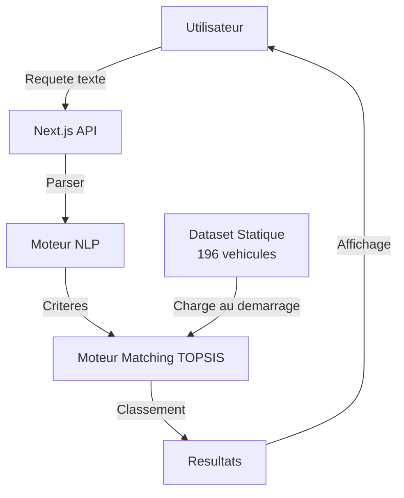

# Thiqti — Registre des Traitements de Donnees

**Ref**: VV-SLP-2026-001
**Date**: 2026-07-29
**Statut**: Active
**Base legale**: Loi 09-08 relative a la protection des personnes physiques a l'egard du traitement des donnees a caractere personnel

---

## 1. Responsable du Traitement

| Champ | Valeur |
|-------|--------|
| **Responsable** | Equipe Thiqti |
| **Contact DPO** | A definir (Phase 2) |
| **Adresse** | Ecole Nationale Superieure d'Informatique (ENSIAS), Rabat, Maroc |
| **Role** | Co-responsables (membres de l'equipe) |

---

## 2. Registre des Traitements

### Traitement 001: Recherche de Vehicules

| Champ | Valeur |
|-------|--------|
| **ID Traitement** | THIQTI-001-SEARCH |
| **Finalite** | Fournir des resultats de recherche vehicule basee sur requete langage naturel |
| **Base legale** | Consentement (l'utilisateur initie la recherche) |
| **Categories de donnees** | Requete texte, donnees de navigation (implicites) |
| **Personnes concernees** | Visiteurs du site web |
| **Retention** | Requetes : 24 heures (rotation logs) |
| **Acces** | Cote serveur uniquement (Node.js) |
| **Transfert** | Aucun (traite au Maroc) |
| **Securite** | HTTPS, aucune donnee personnelle stockee |

### Traitement 002: Authentification Admin (Phase 1)

| Champ | Valeur |
|-------|--------|
| **ID Traitement** | THIQTI-002-AUTH |
| **Finalite** | Authentifier l'administrateur pour les endpoints prives |
| **Base legale** | Consentement (admin fournit email + mot de passe) |
| **Categories de donnees** | Email, hash bcrypt du mot de passe |
| **Personnes concernees** | Administrateur unique |
| **Retention** | Jusqu'a rotation du mot de passe |
| **Acces** | Cookie httpOnly, JWT signe, cote serveur uniquement |
| **Transfert** | Aucun |
| **Securite** | bcryptjs, jose JWT, cookie secure sameSite strict |

---

## 3. Categories de Donnees Detaillees

### 3.1 Donnees Vehicules (Non-Personnelles)

| Categorie | Exemples | Source | Rafraichissement |
|-----------|----------|--------|-------------------|
| Fiches techniques | Marque, modele, annee, motorisation | Dataset statique (196 vehicules) | Manuel (PR) |
| Prix | Neuf, occasion | Dataset statique | Manuel (PR) |
| Images | Photos vehicules | Google CDN | On-demand |
| Caracteristiques | Dimensions, consommation, CO2 | Dataset statique | Manuel (PR) |

### 3.2 Donnees Utilisateur (Personnelles — Phase 2+)

| Categorie | Exemples | Stockage | Retention |
|-----------|----------|----------|-----------|
| Session | ID session anonyme | LocalStorage | Jusqu'a suppression |
| Favoris | IDs vehicules sauvegardes | LocalStorage | Jusqu'a suppression |
| Historique | Requetes recentes (optionnel) | LocalStorage | 24 heures |

---

## 4. Flux de Donnees (Phase 1)

```mermaid
flowchart TD
    A[Utilisateur] -->|Requete texte| B[Next.js API]
    B -->|Parser| C[Moteur NLP]
    C -->|Criteres| D[Moteur Matching TOPSIS]
    D -->|Classement| E[Resultats]
    E -->|Affichage| A
    
    F[Dataset Statique<br>196 vehicules] -->|Charge au demarrage| D
```

---

## 5. Droits des Personnes Concernees

| Droit | Loi 09-08 Article | Implementation | Phase |
|-------|-------------------|----------------|-------|
| **Droit d'acces** | Art. 28 | `GET /api/user/data` | Phase 2 |
| **Droit de rectification** | Art. 29 | `PUT /api/user/data` | Phase 2 |
| **Droit de suppression** | Art. 30 | `DELETE /api/user/data` | Phase 2 |
| **Droit d'opposition** | Art. 31 | Mecanisme opt-out | Phase 2 |
| **Droit a la portabilite** | Art. 28 | Export JSON | Phase 2 |

---

## 6. Mesures de Securite Techniques

| Mesure | Implementation |
|--------|----------------|
| Chiffrement en transit | HTTPS (TLS 1.3) via Vercel |
| Validation d'entree | Max 200 chars, whitelist caracteres |
| Prevention XSS | React auto-escaping + CSP |
| Prevention injection | Regex parser, pas de SQL interprete |
| Protection secrets | Variables d'environnement, `.env.example` sans valeurs |

---

## 7. Transfers Internationaux de Donnees

| Transfert | Destination | Sauvegarde | Base legale |
|-----------|-------------|------------|-------------|
| Hebergement Vercel | Vercel Inc. (US) | Data Processing Agreement | Consentement |

---

## 8. Evaluation d'Impact (DPIA)

| Critere | Present? | Justification |
|---------|----------|---------------|
| Surveillance systematique | Non | Pas de tracking utilisateur |
| Donnees sensibles | Non | Pas de donnees sante, biomeetriques, ou politiques |
| Decisions automatisees | Non | Les resultats de recherche sont des suggestions, pas des decisions |
| Grande echelle | Non | MVP avec < 1000 utilisateurs |

**DPIA Requise**: Non (le MVP n'atteint pas le seuil)

---

## 9. Plan de Reponse aux Violations de Donnees

| Etape | Action | Delai |
|-------|--------|-------|
| 1. Detection | Surveiller logs et erreurs | Immediate |
| 2. Evaluation | Determiner severite et donnees affectees | 24 heures |
| 3. Containment | Bloquer le vecteur d'attaque, revoquer les acces | 24 heures |
| 4. Notification (CNDP) | Rapporter a la CNDP | 72 heures |
| 5. Notification (Users) | Informer si risque eleve | 72 heures |
| 6. Correction | Corriger la vulnerabilite | 1 semaine |

---

## 10. Politique Cookies

| Type Cookie | Utilise? | Finalite |
|-------------|----------|----------|
| Essentiel | Non | Pas de cookies session |
| Analytique | Non | Pas de tracking |
| Marketing | Non | Pas de pubs |
| Preferences | Non | LocalStorage uniquement |

---

## 11. Notification CNDP

| Critere | Present? |
|---------|----------|
| Traitement de donnees personnelles | Phase 2 uniquement (favoris) |
| Plus de 50 personnes concernees | Improbable en MVP |
| Decisions automatisees | Non |
| Donnees sensibles | Non |

**Notification Requise**: Pas encore (Phase 1 n'a pas de PII). Enregistrement en Phase 2.

---

## 12. Checklist Conformite

| Exigence | Statut | Notes |
|----------|--------|-------|
| Base legale du traitement | Valide | Consentement (recherches) |
| Limitation de finalite | Valide | Recherche vehicule uniquement |
| Minimisation des donnees | Valide | Aucune donnee inutile collectee |
| Exactitude | Valide | Donnees verifiees manuellement |
| Limitation de stockage | Valide | Logs rotation 24h |
| Integrite et confidentialite | Valide | HTTPS, CSP, validation |
| Droits des personnes | En attente | Phase 2 endpoints API |
| Nomination DPO | En attente | Phase 2 |
| DPIA | N/A | Pas requis pour MVP |
| Notification CNDP | En attente | Phase 2 |
