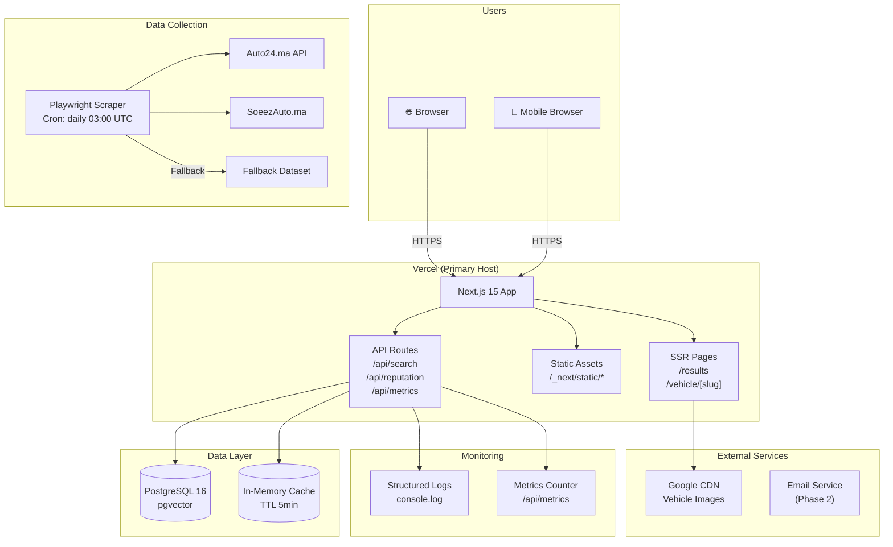

# SLEIPNIR — Deployment Architecture

**Ref**: VV-SLP-2026-001  
**Date**: 2026-07-17  
**Status**: Active

---

## 1. Deployment Diagram



---

## 2. Environment Matrix

| Aspect | Development | Staging | Production |
|--------|-------------|---------|------------|
| **URL** | `localhost:3000` | `thiqti-staging.vercel.app` | `thiqti.vercel.app` |
| **Branch** | `main` | `develop` | `main` (tagged release) |
| **Node** | 20.x | 20.x | 20.x |
| **Database** | Local Docker (`thiqti-db`) | Supabase Pro | Supabase Pro |
| **Cache** | In-memory | In-memory | In-memory |
| **SSL** | None (local) | Vercel auto | Vercel auto |
| **Playwright** | Manual run | Scheduled daily | Scheduled daily 03:00 UTC |
| **Logs** | Console | Vercel Function Logs | Vercel Function Logs |
| **Error Tracking** | Console | Console | Console (Sentry Phase 2) |
| **Rate Limiting** | None | None | None (Phase 2) |
| **CDN** | Local `/public` | Google CDN | Google CDN |

---

## 3. Secrets Management

### Required Environment Variables

| Secret | Where Used | Phase | Vercel Project Setting |
|--------|-----------|-------|------------------------|
| `NEXT_PUBLIC_SUPABASE_URL` | DB connection | Phase 2 | ✅ |
| `NEXT_PUBLIC_SUPABASE_ANON_KEY` | Client-side DB | Phase 2 | ✅ |
| `SUPABASE_SERVICE_ROLE_KEY` | Server-side DB | Phase 2 | ✅ (server only) |
| `AUTO24_API_KEY` | Data collection | Phase 1 | ✅ |
| `PLAYWRIGHT_BROWSERS_PATH` | Scraper | Phase 2 | ✅ |

### Secrets Rules

1. **Never** commit `.env*` files (`.gitignore` enforced)
2. **Never** expose `SUPABASE_SERVICE_ROLE_KEY` to client bundle
3. Use `NEXT_PUBLIC_*` prefix only for truly public values
4. Rotate keys quarterly
5. Use Vercel Environment Variables (encrypted at rest)

---

## 4. SSL & Security Headers

```typescript
// next.config.ts — Security Headers
const securityHeaders = [
  { key: 'Strict-Transport-Security', value: 'max-age=63072000; includeSubDomains; preload' },
  { key: 'X-Content-Type-Options', value: 'nosniff' },
  { key: 'X-Frame-Options', value: 'DENY' },
  { key: 'X-XSS-Protection', value: '1; mode=block' },
  { key: 'Referrer-Policy', value: 'strict-origin-when-cross-origin' },
  { key: 'Permissions-Policy', value: 'camera=(), microphone=(), geolocation=()' },
  { key: 'Content-Security-Policy', value: "default-src 'self'; img-src 'self' https://*.googleapis.com https://*.gstatic.com data:; script-src 'self' 'unsafe-eval' 'unsafe-inline'; style-src 'self' 'unsafe-inline';" },
];
```

- **SSL**: Automatic via Vercel (Let's Encrypt)
- **HSTS**: Enabled with 2-year max-age
- **CSP**: Restrictive policy, images from Google CDN only

---

## 5. Monitoring & Observability

### Phase 1 (MVP)

| Layer | Tool | Purpose |
|-------|------|---------|
| Application logs | `console.log` structured | `[Sources]`, `[NLP]`, `[Matching]` tags |
| Error logs | `console.error` | Stack traces |
| Metrics endpoint | `/api/metrics` | Real-time counters |
| Uptime | Vercel Dashboard | Built-in |

### Phase 2 (Post-MVP)

| Layer | Tool | Purpose |
|-------|------|---------|
| APM | Vercel Analytics | Web Vitals, response times |
| Error tracking | Sentry | Error grouping, alerts |
| Database | Supabase Dashboard | Query performance, storage |

### Metrics Collected

```typescript
interface Metrics {
  totalSearches: number;        // Total search requests
  avgResponseTimeMs: number;    // Average /api/search latency
  sourceStats: Record<string, number>;  // { auto24: 70, fallback: 80 }
  topQueries: string[];         // Last 10 queries
  errorCount: number;           // Total errors
}
```

---

## 6. CI/CD Pipeline

```mermaid
gitgraph
    commit id: "feat: new feature"
    branch develop
    checkout develop
    commit id: "lint + typecheck pass"
    checkout main
    merge develop id: "PR merged"
    commit id: "Vercel auto-deploy → Production"
```

### Pipeline Steps

| Step | Tool | Command |
|------|------|---------|
| 1. Lint | ESLint | `npm run lint` |
| 2. Typecheck | tsc | `npm run typecheck` |
| 3. Test | Vitest | `npm run test` |
| 4. Build | Next.js | `npm run build` |
| 5. Deploy | Vercel | Auto on push to `main` |

### Deployment Trigger

- **Production**: Push/merge to `main` branch
- **Preview**: Any PR (Vercel generates preview URL)
- **Manual**: `vercel --prod` CLI

---

## 7. Rollback Strategy

| Scenario | Action |
|----------|--------|
| Bad deploy | Vercel instant rollback to previous deployment |
| DB migration failure | Restore from Supabase daily backup |
| Scraper broken | Disable cron, use fallback dataset |

---

## 8. Scaling Considerations (Phase 2+)

| Load Level | Action |
|------------|--------|
| 100 searches/day | No change (free tier) |
| 1000 searches/day | Upgrade Vercel Pro ($20/mo) |
| 10,000 searches/day | Add Supabase Pro ($25/mo), CDN cache |
| 50,000+ searches/day | Edge functions, Redis cache, DB read replicas |
