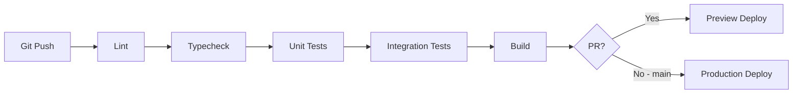

# SLEIPNIR — Testing Strategy

**Ref**: VV-SLP-2026-001  
**Date**: 2026-07-17  
**Status**: Active

---

## 1. Testing Pyramid

```
          ┌─────────┐
          │  E2E    │  ← Playwright (full user journey)
          │  (5%)   │
         ┌┴─────────┴┐
         │ Integration │  ← API endpoints, data collection
         │   (25%)     │
        ┌┴─────────────┴┐
        │    Unit Tests   │  ← NLP, matching, utilities
        │     (70%)       │
        └─────────────────┘
```

---

## 2. Unit Tests (70%)

### 2.1 NLP Extraction (`src/lib/nlp.ts`)

| Test Case | Input | Expected Output |
|-----------|-------|-----------------|
| Make extraction | "je cherche une Toyota Corolla" | `{ make: "Toyota", model: "Corolla" }` |
| Budget extraction | "budget 300000 DH" | `{ budget: 300000 }` |
| Year extraction | "année 2020 ou plus récent" | `{ yearMin: 2020 }` |
| Fuel extraction | "diesel" | `{ fuel: "diesel" }` |
| Body type extraction | "SUV familial" | `{ bodyType: "SUV" }` |
| Combined extraction | "Toyota SUV diesel 2020 budget 400k" | Full criteria object |
| Arabic input | " toyota سيفيك" | `{ make: "Toyota" }` |
| Fuzzy matching | "toyta" (typo) | `{ make: "Toyota" }` |
| Empty input | "" | `{}` (no criteria) |
| Special chars | `<script>alert(1)</script>` | `{}` (sanitized) |

```typescript
// Example test structure
describe('extractCriteria', () => {
  it('should extract make and model', () => {
    const result = extractCriteria('je cherche une Toyota Corolla');
    expect(result.make).toBe('Toyota');
    expect(result.model).toBe('Corolla');
  });

  it('should extract budget from DH format', () => {
    const result = extractCriteria('budget 300000 DH');
    expect(result.budget).toBe(300000);
  });

  it('should handle Arabic input', () => {
    const result = extractCriteria(' toyota');
    expect(result.make).toBe('Toyota');
  });

  it('should sanitize XSS in input', () => {
    const result = extractCriteria('<script>alert(1)</script>');
    expect(result).toEqual({});
  });
});
```

### 2.2 Matching Engine (`src/lib/matching.ts`)

| Test Case | Input | Expected Output |
|-----------|-------|-----------------|
| TOPSIS score | 5 vehicles, 3 criteria | Scores between 0-1 |
| Best match first | Ranked list | Top score at index 0 |
| Budget filtering | Budget 300k, vehicles at 200k-500k | Only ≤300k in results |
| Body type filtering | SUV request, mixed list | Only SUVs (or fallback) |
| Fuel matching | Diesel request, petrol+diesel list | Diesel preferred |
| Explanation generation | Vehicle + criteria | `MatchExplanation[]` with impact labels |
| Empty vehicle list | 0 vehicles | Empty results |
| Single vehicle | 1 vehicle | Returns that vehicle with score |
| Weight adaptation | "économique" profile | Higher price weight |

```typescript
describe('rankVehicles', () => {
  it('should rank vehicles by TOPSIS score', () => {
    const vehicles = mockVehicles(5);
    const criteria = { budget: 300000, fuel: 'diesel' };
    const ranked = rankVehicles(vehicles, criteria);
    expect(ranked[0].matchScore).toBeGreaterThanOrEqual(ranked[1].matchScore);
  });

  it('should filter by budget', () => {
    const vehicles = [{ price: 200000 }, { price: 400000 }];
    const criteria = { budget: 300000 };
    const ranked = rankVehicles(vehicles, criteria);
    expect(ranked).toHaveLength(1);
  });

  it('should generate explanations', () => {
    const ranked = rankVehicles(mockVehicles(1), { budget: 300000 });
    expect(ranked[0].explanations).toBeDefined();
    expect(ranked[0].explanations.length).toBeGreaterThan(0);
  });
});
```

### 2.3 Utility Functions

| Module | Tests |
|--------|-------|
| `src/lib/normalize.ts` | Price normalization, string lowercase, accent removal |
| `src/lib/dedup.ts` | Vehicle deduplication by key, merge images |
| `src/lib/fallback.ts` | Dataset loading, filtering, search |

---

## 3. Integration Tests (25%)

### 3.1 API Endpoints

| Endpoint | Method | Test Case | Expected |
|----------|--------|-----------|----------|
| `/api/search?q=Toyota+diesel` | GET | Valid query | 200 + vehicle array |
| `/api/search?q=` | GET | Empty query | 400 + error |
| `/api/search?q=<script>` | GET | XSS attempt | 400 + sanitized |
| `/api/reputation?make=Toyota` | GET | Valid make | 200 + reputation data |
| `/api/reputation?make=` | GET | Missing param | 400 + error |
| `/api/metrics` | GET | Any time | 200 + metrics object |

### 3.2 Data Collection

| Test Case | Expected |
|-----------|----------|
| Auto24 API fetch | Returns vehicle array |
| Auto24 API down | Falls back to dataset |
| SoeezAuto scraping | Returns price data |
| SoeezAuto blocked | Logs warning, continues |
| Deduplication | Merged vehicles, no duplicates |

### 3.3 Database Operations (Phase 2)

| Test Case | Expected |
|-----------|----------|
| Insert vehicle | Row created |
| Query by make | Filtered results |
| Full-text search | Ranked results |
| Vector similarity | pgvector results |

---

## 4. E2E Tests (5%) — Playwright

### 4.1 Full User Journey

```typescript
test.describe('Search Journey', () => {
  test('should complete a full search flow', async ({ page }) => {
    // 1. Landing page loads
    await page.goto('/');
    await expect(page.locator('h1')).toContainText('SLEIPNIR');

    // 2. Type query
    await page.fill('[data-testid="search-input"]', 'Toyota SUV diesel budget 300000');

    // 3. Submit search
    await page.click('[data-testid="search-button"]');

    // 4. Results page loads
    await expect(page).toHaveURL(/\/results/);
    await expect(page.locator('[data-testid="vehicle-card"]')).toHaveCount({ minimum: 1 });

    // 5. Click vehicle
    await page.click('[data-testid="vehicle-card"]:first-child');

    // 6. Vehicle detail page
    await expect(page).toHaveURL(/\/vehicle\//);
    await expect(page.locator('[data-testid="vehicle-price"]')).toBeVisible();
  });
});
```

### 4.2 Test Scenarios

| Scenario | Steps |
|----------|-------|
| Happy path | Search → Results → Vehicle detail |
| Empty results | Search nonsense → "no results" message |
| Fallback | Search unavailable make → fallback data shown |
| Mobile responsive | 375px viewport → layout adapts |
| Favorites (Phase 2) | Add favorite → persist → view favorites |

---

## 5. Coverage Targets

| Area | Target | Measurement |
|------|--------|-------------|
| Business logic (NLP, matching) | ≥ 70% | Vitest coverage |
| API endpoints | 100% | Integration tests |
| Components | ≥ 50% | Render tests |
| E2E critical paths | 100% | Playwright |

---

## 6. CI Pipeline



### Pipeline Commands

```bash
# Step 1: Lint
npm run lint

# Step 2: Typecheck
npm run typecheck

# Step 3: Unit + Integration Tests
npm run test

# Step 4: Build
npm run build
```

### CI Configuration (`.github/workflows/ci.yml`)

```yaml
name: CI
on:
  push:
    branches: [main, develop]
  pull_request:
    branches: [main]

jobs:
  test:
    runs-on: ubuntu-latest
    steps:
      - uses: actions/checkout@v4
      - uses: actions/setup-node@v4
        with:
          node-version: 20
          cache: 'npm'
      - run: npm ci
      - run: npm run lint
      - run: npm run typecheck
      - run: npm run test -- --coverage
      - run: npm run build
```

---

## 7. Test Data Management

| Data Type | Strategy |
|-----------|----------|
| Mock vehicles | `tests/__mocks__/vehicles.ts` — 10 sample vehicles |
| Mock API responses | MSW (Mock Service Worker) for integration tests |
| Snapshot testing | UI components for visual regression |
| Seed data | `packages/database/seed.sql` for DB tests |

---

## 8. Testing Tools

| Tool | Purpose | Version |
|------|---------|---------|
| Vitest | Unit + integration tests | ^1.0.0 |
| Playwright | E2E tests | ^1.61.1 |
| MSW | API mocking | ^2.0.0 |
| @testing-library/react | Component tests | ^14.0.0 |
| c8 | Code coverage | ^8.0.0 |

---

## 9. Test Execution

| Command | Scope |
|---------|-------|
| `npm run test` | All unit + integration tests |
| `npm run test:watch` | Watch mode for development |
| `npm run test:e2e` | Playwright E2E tests |
| `npm run test:coverage` | Coverage report |
