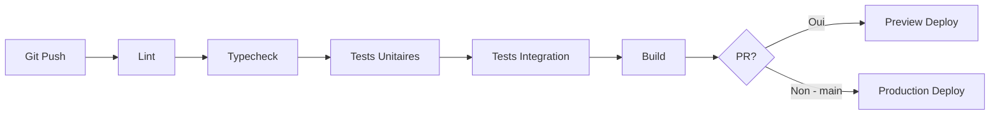

# Thiqti — Strategie de Tests

**Ref**: VV-SLP-2026-001
**Date**: 2026-07-29
**Statut**: Active

---

## 1. Pyramide de Tests

```
          +-----------+
          |   E2E     |  Playwright (Phase 2)
          |   (10%)   |
         ++-----------++
         | Integration |  API endpoints, matching pipeline
         |    (30%)    |
        ++-------------++
        |    Unit Tests   |  NLP, matching, utilitaires
        |     (60%)       |
        +-----------------+
```

---

## 2. Tests Unitaires (60%)

### 2.1 Extraction NLP

| Cas de Test | Entree | Sortie Attendue |
|-------------|--------|-----------------|
| Extraction marque | "je cherche une Toyota Corolla" | `{ make: "Toyota", model: "Corolla" }` |
| Extraction budget | "budget 300000 DH" | `{ budget: 300000 }` |
| Extraction carburant | "diesel" | `{ fuel: "diesel" }` |
| Extraction type | "SUV familial" | `{ bodyType: "SUV" }` |
| Input arabe | " toyota سيفيك" | `{ make: "Toyota" }` |
| Fuzzy matching | "toyta" (typo) | `{ make: "Toyota" }` |
| Input vide | "" | `{}` |
| Caracteres speciaux | `<script>alert(1)</script>` | `{}` (sanitized) |

### 2.2 Moteur Matching (TOPSIS)

| Cas de Test | Entree | Sortie Attendue |
|-------------|--------|-----------------|
| Score TOPSIS | 5 vehicules, 3 criteres | Scores entre 0-1 |
| Meilleur score en premier | Liste rankee | Top score a l'index 0 |
| Filtrage budget | Budget 300k | Seulement <= 300k dans les resultats |
| Filtrage type | SUV request, liste mixte | SUVs preferes (ou fallback) |
| Filtrage carburant | Diesel request | Diesel preferes |
| Generation explications | Vehicule + criteres | `MatchExplanation[]` avec labels |
| Liste vide | 0 vehicules | Resultats vides |
| Vehicule unique | 1 vehicule | Retourne avec score |

---

## 3. Tests d'Integration (30%)

### 3.1 Endpoints API

| Endpoint | Methode | Cas de Test | Attendu |
|----------|---------|-------------|---------|
| `/api/search?q=Toyota+diesel` | GET | Requete valide | 200 + vehicle array |
| `/api/search?q=` | GET | Requete vide | 400 + error |
| `/api/search?q=<script>` | GET | XSS attempt | 400 + sanitized |
| `/api/auth/login` | POST | Credentials valides | 200 + cookie set |
| `/api/auth/login` | POST | Mauvais mot de passe | 401 |
| `/api/auth/me` | GET | Cookie valide | 200 + email |
| `/api/auth/me` | GET | Pas de cookie | 401 |

### 3.2 Pipeline Matching

| Cas de Test | Attendu |
|-------------|---------|
| NLP -> TOPSIS pipeline | Criteres correctement extraits et appliques |
| Cache hit | Reponse < 5ms |
| Cache miss | Reponse < 100ms (premier appel) |

---

## 4. Tests E2E (10% — Phase 2)

### 4.1 Parcours Utilisateur

```typescript
test('recherche complete', async ({ page }) => {
  await page.goto('/');
  await page.fill('[data-testid="search-input"]', 'Toyota SUV diesel budget 300000');
  await page.click('[data-testid="search-button"]');
  await expect(page.locator('[data-testid="vehicle-card"]')).toHaveCount({ minimum: 1 });
});
```

### 4.2 Scenarios

| Scenario | Etapes |
|----------|--------|
| Parcours normal | Search > Results > Detail |
| Aucun resultat | Search nonsense > message "aucun resultat" |
| Mobile responsive | 375px > layout adapte |

---

## 5. Cibles de Couverture

| Zone | Cible | Outil |
|------|-------|-------|
| Logique metier (NLP, matching) | >= 70% | Vitest coverage |
| Endpoints API | 100% | Tests integration |
| Composants | >= 50% | Render tests |

---

## 5.1 Etat des Lieux (2026-07-31)

**Exigence CDC 7.6**: couverture minimale de 70% sur la logique metier.

Resultats `npm run test:coverage` (branche `fix/cdc-compliance`):

| Workspace | Perimetre | % Stmts | % Branch | % Funcs | % Lines |
|-----------|-----------|---------|----------|---------|---------|
| apps/web | `src/lib/**` (NLP, matching, sources) | 93.31 | 88.01 | 84.44 | 93.43 |
| apps/api | `src/**/*.service.ts` (vehicles, reputation) | 100 | 92.1 | 100 | 100 |

Toutes les metriques de la logique metier sont au-dessus de 70%.

**Inventaire des tests** (125 tests au total):

| Fichier | Zone | Nombre |
|---------|------|--------|
| `apps/web/tests/matching.test.ts` | Invariants TOPSIS | 7 |
| `apps/web/tests/benchmark.test.ts` | Benchmark 38 requetes + sensibilite | 43 |
| `apps/web/tests/nlp.test.ts` | Extraction NLP FR/AR/Darija | 39 |
| `apps/web/tests/sources.test.ts` | Normalisation, score, catalogue | 17 |
| `apps/api/test/reputation.service.test.ts` | Service reputation (repos mocks) | 6 |
| `apps/api/test/vehicles.service.test.ts` | Service vehicles (query builder mock) | 13 |

**Limites connues**:
- Les tests API mockent les repositories TypeORM (aucune base de donnees requise). Les endpoints HTTP complets (`/api/search`, `/api/reputation`, `/api/auth/*`) ne sont pas testes bout en bout : cela necessite PostgreSQL (Docker) et le module NestJS de test.
- Les composants React et les pages ne sont pas couverts (pas de render tests).

---

## 6. Pipeline CI


```mermaid
graph LR
    A[Git Push] --> B[Lint]
    B --> C[Typecheck]
    C --> D[Tests Unitaires]
    D --> E[Tests Integration]
    E --> F[Build]
    F --> G{PR?}
    G -->|Oui| H[Preview Deploy]
    G -->|Non - main| I[Production Deploy]
```

### Commandes

```bash
npm run lint          # Etape 1
npm run typecheck     # Etape 2
npm run test          # Etape 3
npm run build         # Etape 4
```

---

## 7. Donnees de Test

| Type | Strategie |
|------|-----------|
| Vehicules mock | `tests/__mocks__/vehicles.ts` — 10 echantillons |
| Reponses API mock | Mock inline dans les tests |
| Dataset fallback | Utilise les vraies donnees (196 vehicules) |

---

## 8. Outils

| Outil | Usage |
|-------|-------|
| Vitest | Tests unitaires + integration |
| TypeScript strict | Verification statique |
| ESLint | Linting |

---

## 9. Execution

| Commande | Perimetre |
|----------|-----------|
| `npm run test` | Tous les tests (web + api) |
| `npm run test:watch` | Mode watch |
| `npm run test:coverage` | Rapport couverture (web + api) |

---

## 10. Plan vers 70% (exigence CDC 7.6)

Objectif : maintenir et etendre la couverture de la logique metier au-dessus de 70%, puis renforcer les couches integration et composants.

| Etape | Action | Impact | Blocage |
|-------|--------|--------|---------|
| 1 (fait) | Tests unitaires NLP (francais, arabe, darija, XSS, cas limites) | `nlp.ts` couvert, 39 tests | Aucun |
| 2 (fait) | Tests services API avec repositories mocks (query builder + CRUD + reputation) | `*.service.ts` a 100%, 19 tests | Aucun |
| 3 (fait) | Tests sources (normalisation, generateId, computeScore, catalogue, cache) | `src/lib/sources` a 98%, 17 tests | Aucun |
| 4 | Seuil CI : ajouter `coverage` avec seuil de blocage (threshold 70%) dans les configs Vitest des workspaces | Protege contre les regressions | A definir avec le pipeline CI |
| 5 | Tests d'integration API : `@nestjs/testing` + PostgreSQL (Docker) pour `/api/search`, `/api/reputation`, `/api/auth/*` | Couvre les endpoints (objectif 100%) | Docker non installe sur la machine actuelle |
| 6 | Render tests React (Vitest + Testing Library ou Playwright component) sur les composants critiques (CarImage, ReputationSummary, recherche) | Composants >= 50% | A definir le choix d'outil |
| 7 | E2E Playwright (Phase 2) : parcours recherche > resultats > detail | E2E 10% | Phase 2 |

Priorisation : l'exigence 7.6 porte sur la logique metier, deja au-dessus du seuil. Les etapes 4 a 7 consolident les couches superieures de la pyramide et protegent le seuil dans le temps.
